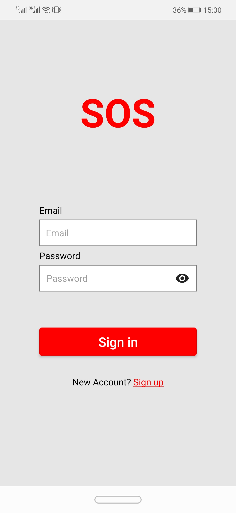

<div align="center">

> Hello world! This is the project’s summary that describes the project plain and simple, limited to the space available. 


**[PROJECT PHILOSOPHY](#project_philosophy) • [WIREFRAMES](#wireframes) • [TECH STACK](#tech_stack) • [IMPLEMENTATION](#implementation) • [HOW TO RUN?](#how_to_run)**

</div>

<br><br>


> The SOS app is an emergency and a user friendly app that helps him/her reach out for help fast when a certain emergency comes up.

> The app sends the location of the person in need of help and connects him/her with the nearest specialist or expert to come for help.

### User Stories
- As a user, I can ask for help with a click of a button to connect me to the nearest expert.
- As a user, I can start a phone call with my emergency contact.
- As a user, I can notify all the remaining users of a certain case.
- As a user, I can edit my profile photo, name, phone number...
- As a user, I can check all the notification alerts with their details.

### Expert Stories
- As an expert, I can recieve the call for help and get the location of the person in need to reach out.
- As an expert, I can recieve a notification whenever a new task arises.
- As an expert, I can follow the map directions to reach the person in need of help.
- As an expert, I can see all my old tasks.

<br><br>

**[PROJECT PHILOSOPHY](#project_philosophy) • [WIREFRAMES](#wireframes) • [TECH STACK](#tech_stack) • [IMPLEMENTATION](#implementation) • [HOW TO RUN?](#how_to_run)• [BACK TO TOP](#top)**

<br><br>


> This design was planned before on paper, then moved to Figma app for the fine details.
Note that i didn't use any styling library or theme, all from scratch and using pure css modules

| Home                                 | Tracking                                 | Profile                                 |
| ------------------------------------ | ---------------------------------------- | --------------------------------------- |
|  |  |  |

| Create Alert                                 | Expert Page                      | Expert History                           |
| -------------------------------------------- | -------------------------------- | ---------------------------------------- |
|  |  |  |


<br><br>

**[PROJECT PHILOSOPHY](#project_philosophy) • [WIREFRAMES](#wireframes) • [TECH STACK](#tech_stack) • [IMPLEMENTATION](#implementation) • [HOW TO RUN?](#how_to_run)• [BACK TO TOP](#top)**

<br><br>


Here's a brief high-level overview of the tech stack the Well app uses:

- This project uses [React Native](https://reactnative.dev/). React Native is an open-source JavaScript framework, designed for building apps on multiple platforms like iOS, Android, and also web applications.
- This project uses [Laravel](https://laravel.com/). Laravel is a backend framework that provides all of the features you need to build modern web applications.
- To send local push notifications, the app uses the [Firebase](https://rnfirebase.io/messaging/notifications) which supports Android and iOS.

<br><br>

**[PROJECT PHILOSOPHY](#project_philosophy) • [WIREFRAMES](#wireframes) • [TECH STACK](#tech_stack) • [IMPLEMENTATION](#implementation) • [HOW TO RUN?](#how_to_run)• [BACK TO TOP](#top)**

<br><br>


> Using the above mentioned tech stacks and the wireframes build with figma from the user and expert sotries we have, the implementation of the app is shown as below, these are animations from the real app

| Sign In                          | Sign Up                          | Call                           | Send Alert                          |
| -------------------------------- | -------------------------------- | ------------------------------ | ----------------------------------- |
|  |  |  |  |

| Asking for Help                | Create Alert                    | Expert Page                           | Expert History                     |
| ------------------------------ | ------------------------------- | ------------------------------------- | ---------------------------------- |
|  |  |  |  |

> Some Hardware animation to show the notifications

| Recieving Notification                 |  Notification List                           |
| -------------------------------------- | -------------------------------------------- |
|  |  |


> And here are some screenshots of the actual application

| Sign In                           | Sign Up                          | Home                           | Notification                           |
| --------------------------------- | -------------------------------- | ------------------------------ | -------------------------------------- |
|  |  |  |  |

| Tracking                                | Profile                           | Expert Page                       | Expert History                |
| --------------------------------------- | --------------------------------- | --------------------------------- | ----------------------------- |
|  |  |  |  |


<br><br>

**[PROJECT PHILOSOPHY](#project_philosophy) • [WIREFRAMES](#wireframes) • [TECH STACK](#tech_stack) • [IMPLEMENTATION](#implementation) • [HOW TO RUN?](#how_to_run)• [BACK TO TOP](#top)**

<br><br>


> This is an example of how you may give instructions on setting up your project locally.
To get a local copy up and running follow these simple example steps.

### Prerequisites

Composer

NodeJs

Expo

### Installation

Clone the repository
   ```sh
    git clone https://github.com/JeanPaul-AbiZeid/SOS.git
   ```
Switch to the server repo folder
   ```sh
    cd SOS-backend
   ```
Install all the dependencies using composer
   ```sh
    composer install
   ```
Copy the example env file and make the required configuration changes in the .env file
   ```sh
    cp .env.example .env
   ```
Generate a new application key
   ```sh
    php artisan key:generate
   ```
Generate a new JWT authentication secret key
   ```sh
    php artisan jwt:generate
   ```
Run the database migrations (**Set the database connection in .env before migrating**)
   ```sh
    php artisan migrate
   ```
Start the local development server
   ```sh
    php artisan serve --host=YOUR IP ADDRESS
   ```
Open a new terminal

Switch to the frontend repo folder
   ```sh
    cd SOS-frontend
   ```
Install NPM packages
   ```sh
    npm install
   ```
Go to [Expo](https://expo.dev/) and create an account. If you aleady have an account, sign in using: 
   ```sh
    expo login
   ```
Create a .env file and put your google API key (ex: API_KEY="YOUR API KEY") for the map to work

Go to ./hooks/userProvider, locate the axiosUrl constant and change (192.168.1.149) to your IP address

Download Expo Go on your Android device

Run the app
   ```sh
    npm start
   ```


